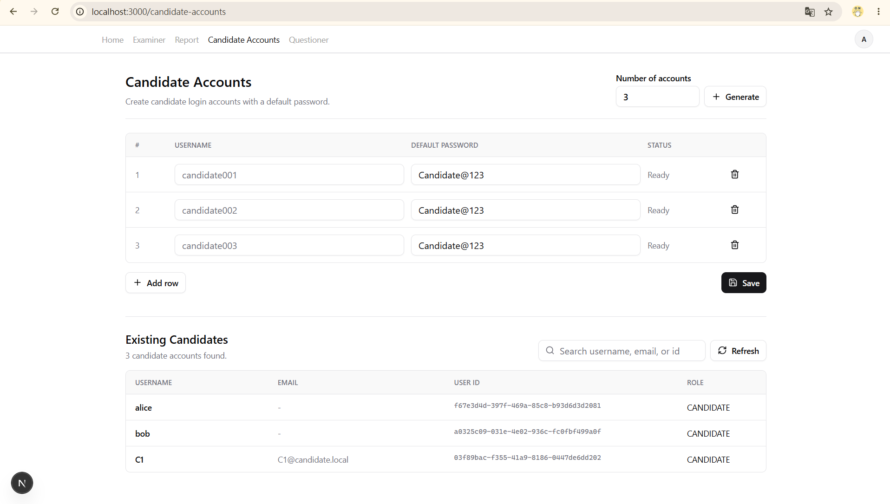

# Online Code Judge 前端

這份前端專案用來搭配 `cn_backend-master` 後端，主要後端 API 皆透過 `/api/v1` 呼叫。

本機前端：

```txt
http://localhost:3000
```

本機後端：

```txt
http://localhost:4100
```

## 最新更新

### Admin 建立與查詢 Candidate 帳號

目前公開的自行註冊入口已從前端畫面移除。Candidate 帳號改由 admin 在前端管理頁面建立。

admin 登入後可開啟：

```txt
/candidate-accounts
```

admin 可以：

- 輸入想要一次建立幾個 candidate 帳號。
- 產生對應數量的帳號欄位。
- 填入每個 candidate 的 username。
- 設定每個帳號的預設 password。
- 按下 Save 後，透過既有後端 signup API 建立帳號。
- 查看目前已存在的 candidate 帳號清單。
- 依 username、email 或 user id 搜尋 candidate。
- 按下 Refresh 重新載入 candidate 清單。

建立 candidate 成功後，頁面會自動重新整理現有 candidate 清單。

畫面示意：



注意：這是前端 UI 層面的管控。後端 signup endpoint 並沒有在這次修改中更動。

## 環境變數

請在前端專案根目錄建立 `.env.local`：

```env
NEXT_PUBLIC_API_BASE_URL=http://localhost:4100
NEXTAUTH_SECRET=online-code-test-local-nextauth-secret
BACKEND_PRIVILEGED_USERNAME=admin
BACKEND_PRIVILEGED_PASSWORD=admin123
```

`BACKEND_PRIVILEGED_USERNAME` 和 `BACKEND_PRIVILEGED_PASSWORD` 是 candidate 進入 interview 時需要的設定。前端的 API route 會使用這組 privileged 後端帳號，查詢與更新 interview-candidate 的時間資料。

## 後端啟動方式

在後端資料夾執行：

```powershell
cd C:\Users\GIGABYTE\Desktop\Devop\cn_backend-master
npm install
npx prisma generate
npx prisma migrate dev
npm run db:seed
npm run start:dev
```

確認後端 health check：

```powershell
Invoke-RestMethod http://localhost:4100/api/v1/health
```

## 前端啟動方式

在這份前端資料夾執行：

```powershell
cd C:\Users\GIGABYTE\Desktop\Devop\online_code_judge-main2
npm install
npm run dev -- --port 3000
```

開啟：

```txt
http://localhost:3000
```

建議使用 `localhost`，不要使用 `127.0.0.1`，避免與後端本機 CORS 設定不一致。

## Seed 測試帳號

後端執行 `npm run db:seed` 後，可使用以下帳號：

```txt
admin / admin123
alice / user123
bob / user123
```

## 基本測試流程

1. 啟動後端，確認後端在 `4100` port。
2. 啟動前端，確認前端在 `3000` port。
3. 使用 `admin / admin123` 登入。
4. 開啟 **Candidate Accounts**。
5. 建立一個或多個 candidate 帳號。
6. 確認新建立的 candidate 出現在 Existing Candidates 清單。
7. 使用搜尋框查詢 candidate。
8. 到 Examiner 頁面建立 interview。
9. 將 candidate 加入該 interview。
10. 指派題目。
11. 登出 admin，改用 candidate 帳號登入。
12. 從 candidate dashboard 進入 interview。

## API 說明

登入與註冊：

```txt
POST /api/v1/auth/login
POST /api/v1/auth/signup
```

Questioner：

```txt
GET    /api/v1/problems
GET    /api/v1/problems/:id
POST   /api/v1/problems
PATCH  /api/v1/problems/:id
DELETE /api/v1/problems/:id
```

Examiner：

```txt
POST   /api/v1/interviews
GET    /api/v1/interviews
PATCH  /api/v1/interviews/:id
DELETE /api/v1/interviews/:id
POST   /api/v1/interview-candidates
GET    /api/v1/interview-candidates
DELETE /api/v1/interview-candidates/:id
POST   /api/v1/assignments
GET    /api/v1/assignments
DELETE /api/v1/assignments/:id
```

Candidate：

```txt
GET /api/v1/assignments/user/:userId
```

Judge 與 submissions：

```txt
POST /api/v1/judge/run
POST /api/v1/submissions
GET  /api/v1/submissions/:id
```

## 驗證方式

執行 lint：

```powershell
npm run lint
```

執行 production build：

```powershell
npm run build
```
